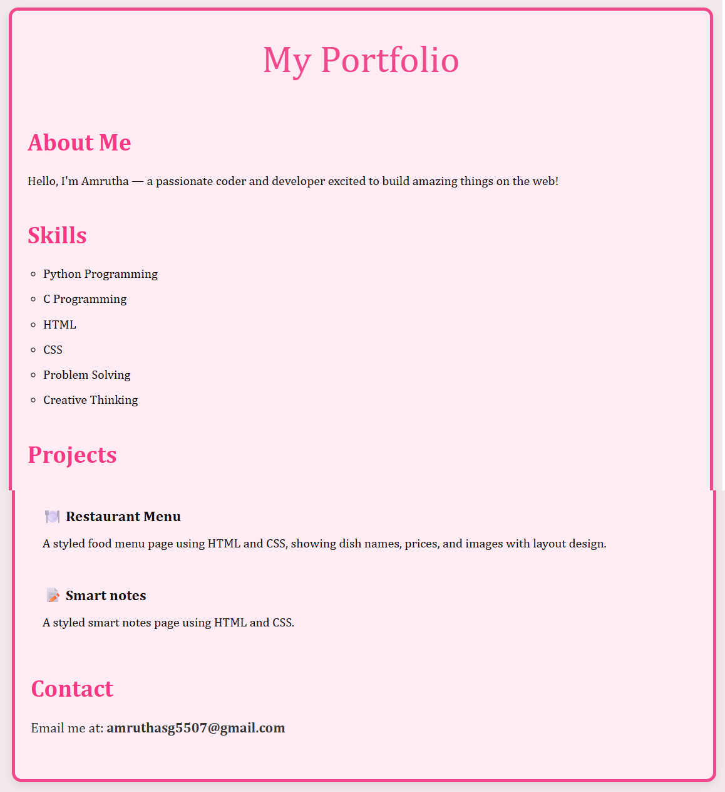

# My-simple-portfolio
# 💼 My Portfolio

This is a **personal portfolio website** built using **HTML** and **CSS**. It showcases my skills, projects, and contact information in a clean and elegant design. Built to practice and demonstrate my front-end web development abilities.

## 🔍 Overview

The portfolio includes:
- A brief **About Me** section
- A list of **Skills**
- A **Projects** section featuring:
  - 🍽️ Restaurant Menu – A styled food menu page using HTML and CSS
  - 📝 Smart Notes – A styled notes page using HTML and CSS
- **Contact** information

## 📸 Screenshot

## 🛠 Technologies Used

- HTML5
- CSS3

## 📁 Folder Structure

portfolio/

*  index.html # Main webpage
*   style.css # Styling for the portfolio
*  creenshot.png # Screenshot for README preview

## 🎯 What I Learned

- Structuring web pages using semantic HTML
- Designing responsive and attractive layouts using CSS
- Organizing personal projects for better presentation

